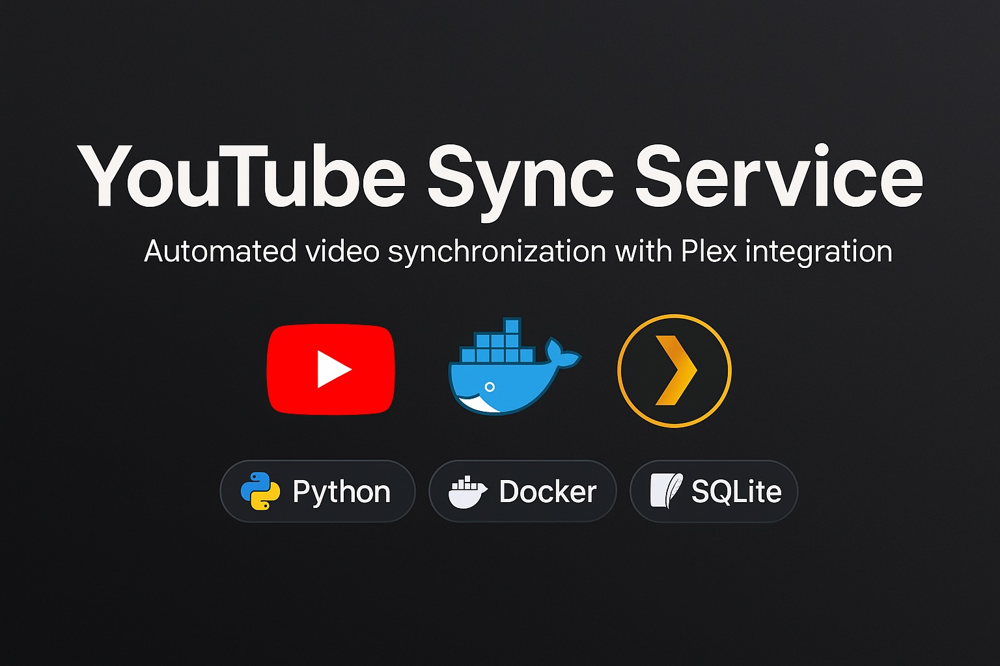

# YouTube Sync Service




Automatic service for synchronizing videos from YouTube channels and playlists.

## Features

- ✅ Automatic video downloads from YouTube channels and playlists
- ✅ **YouTube restrictions bypass using browser cookies**
- ✅ YAML configuration file
- ✅ File naming in "Title-YYYY-MM-DD.extension" format
- ✅ Best quality downloads
- ✅ Individual period settings for each source
- ✅ Built-in yt-dlp filters for efficiency
- ✅ Plex Media Server compatibility
- ✅ Docker containerization
- ✅ Scheduler for automatic synchronization
- ✅ Comprehensive logging

## Use Cases

### 🏠 Home Media Server
- **Automatic synchronization** of favorite YouTube channels for offline viewing
- **Plex/Jellyfin integration** for video collection organization
- **Traffic savings** - download during night hours with unlimited internet

### 📚 Educational Content
- **Saving courses and lectures** from educational channels
- **Creating local library** for offline learning
- **Archiving** important content that might be deleted

### 🎬 Content Creators
- **Competitor monitoring** - automatic download of new videos
- **Content collections** creation by topics for trend analysis
- **Backup own content** from backup channels

### 🏢 Corporate Use
- **Archiving** corporate YouTube channels
- **Compliance** requirements for content preservation
- **Content analytics** for marketing research

### 🌐 Geographic Restrictions
- **Bypass blocks** - download via VPN for later viewing
- **Preserve** region-blocked content
- **Access content** in areas with poor internet
- **Bypass age restrictions** - using browser cookies

## Quick Start

### 1. User Configuration

Create `.env` file for UID/GID settings:

```bash
# Find your UID and GID
id -u  # UID
id -g  # GID

# Create .env file
cp .env.example .env
# Edit values in .env file
```

### 2. Configuration Setup

Edit `config.yaml` file:

```yaml
youtube:
  channels:
    - url: "https://www.youtube.com/@yourchannel1"
      period_days: 30  # Download last 30 days
      output_dir: "./downloads/CHANNEL1"  # Individual folder
    - url: "https://www.youtube.com/@yourchannel2"
      period_days: 14  # Download last 2 weeks
      output_dir: "./downloads/CHANNEL2"

  playlists:
    - url: "https://www.youtube.com/playlist?list=PLyour_playlist"
      period_days: 60  # Download last 2 months
      output_dir: "./downloads/playlists/MY_PLAYLIST"

download:
  output_dir: "./downloads"  # Default folder
  quality: "bestvideo[height<=1080][ext=mp4]+bestaudio[ext=m4a]/bestvideo[height<=1080]+bestaudio/best[height<=1080][ext=mp4]/best[height<=720]/best"
  default_period_days: 30

scheduler:
  sync_interval_hours: 6
  first_run_time: "08:00"
```

### 3. Docker Compose Launch

```bash
# Build and run
docker-compose up -d

# View logs
docker-compose logs -f ytsync

# Stop
docker-compose down
```

### 4. Run without Docker

```bash
# Install dependencies
pip install -r requirements.txt

# Run service
python main.py
```

## Configuration Format

```yaml
youtube:
  channels:
    - url: "https://www.youtube.com/@channel"
      period_days: 30
  playlists:
    - url: "https://www.youtube.com/playlist?list=playlist"
      period_days: 60

cookies:
  enabled: true
  cookie_file: "/path/to/cookies.txt"
```

## Project Structure

```
ytsync/
├── main.py              # Main service code
├── config.yaml          # Configuration
├── requirements.txt     # Python dependencies
├── Dockerfile          # Docker image
├── docker-compose.yml  # Docker Compose configuration
├── db/                 # SQLite database
│   └── ytsync.db       # Downloaded videos tracking
└── downloads/          # Downloaded videos folder
```

## Cookie Configuration for YouTube Restrictions Bypass

YouTube blocks access to age-restricted content without authentication. This section describes how to configure cookies to bypass restrictions.

### ⚠️ Important for Docker

Docker service has no access to browsers. Cookies must be extracted **LOCALLY** and passed to configuration.

### Cookie Configuration Methods

#### 1. Cookie File (recommended for Docker)

```yaml
cookies:
  enabled: true
  cookie_file: "/path/to/cookies.txt"
```

**Creating cookie file:**
```bash
# Locally on machine with browser
yt-dlp --cookies-from-browser safari --cookies cookies.txt --no-download --simulate https://youtube.com
```


### Docker Workflow

1. **Locally:** Extract cookies to file using yt-dlp
2. **On server:** Copy cookie file and specify path in config.yaml
3. **Restart:** Restart Docker container

### Cookie Diagnostics

With DEBUG logging level enabled, you'll see:
- Number of loaded cookies
- Presence of important YouTube cookies
- Cookie header preview

```yaml
logging:
  level: "DEBUG"
```

### Cookie Security

- Cookies contain personal data - don't publish them
- Regularly update cookies (monthly)
- Store cookie files securely

## Troubleshooting

### Common Issues

**Q: "Sign in to confirm your age" error**
A: YouTube requires authentication for age-restricted content. Configure browser cookies (see "Cookie Configuration" section).

**Q: Cookies don't work in Docker**
A: Cookies must be extracted locally and passed to configuration. Docker container has no access to browsers.

**Q: "HTTP Error 429" or "Too Many Requests" error**
A: YouTube limits request frequency. Increase synchronization interval or add delays.

### Cookie Extraction Issues

**Q: extract_cookies.py times out**
A: This tool is for local use only. Extract cookies locally and copy configuration to server.

**Q: No important cookies found**
A: Ensure you're logged into YouTube in your browser before extracting cookies.

## License

This project is distributed under MIT License. See [LICENSE](LICENSE) file for details.

**What this means:**
- ✅ Free use in personal and commercial projects
- ✅ Code modification and distribution
- ✅ Creating derivative works
- ⚠️ Attribution required
- ⚠️ Provided "as is", without warranties
